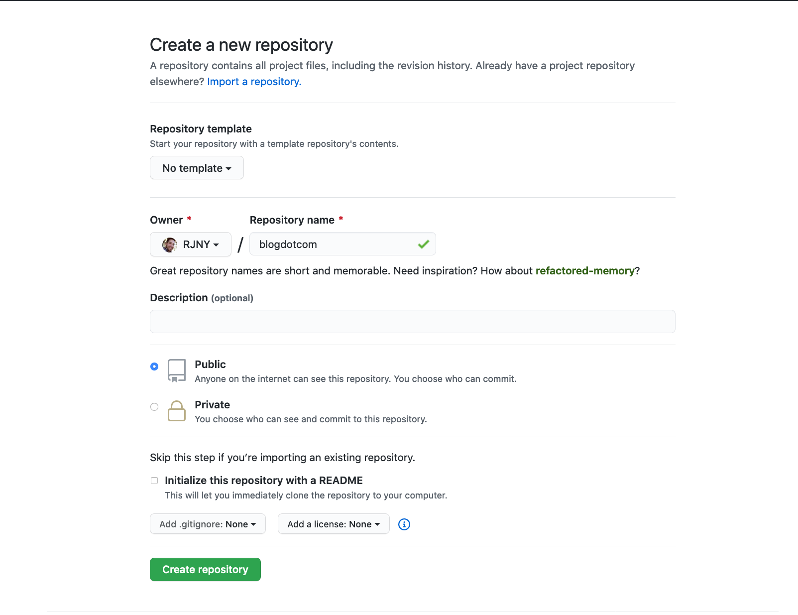

## Picking a Gatsby Starter template

First thing you'll need is a website to deploy. I didn't need anything fancy, so I went with a
Gatsby starter template for now.

https://www.gatsbyjs.org/starters?v=2

## Cooking with the cookie-cutter

Once you've picked your starter template, use the link to their github in the instructions they've
given below.

I picked this one: https://www.gatsbyjs.org/starters/gatsbyjs/gatsby-starter-blog/

Example:

```bash
gatsby new blogdotcom https://github.com/gatsbyjs/gatsby-starter-blog

```

#### What did this command do?

`gatsby new` will create a greenfield gatsby application.

`blogdotcom` is the name of the folder in which is being
created.

The last argument `https://github.com/gatsbyjs/gatsby-starter-blog` is literally a link to
the github repo where the starter template lives in. Gatsby uses this repository as a
cookie-cutter/starter template for you to begin development with.

## Local development with your new starter

Now we should be able to start development on our new gatsby website.

```bash
cd blogdotcom
```

```
$ gatsby develop

success open and validate gatsby-configs - 0.056s
success load plugins - 4.113s
warn The Google Analytics plugin requires a tracking ID. Did you mean to add it?
success onPreInit - 0.019s
success initialize cache - 0.010s
success copy gatsby files - 0.058s
warn gatsby-plugin-feed was initialized in gatsby-config.js without a feeds option.
This means that the plugin will use the internal RSS feed creation, which may not match your use case.
This behavior will be removed in the next major release of gatsby-plugin-feed.
For more info, check out: https://gatsby.dev/adding-rss-feed
success onPreBootstrap - 0.022s
success createSchemaCustomization - 0.130s
success source and transform nodes - 0.120s
success building schema - 0.271s
success createPages - 0.031s
success createPagesStatefully - 0.066s
success updating schema - 0.031s
success onPreExtractQueries - 0.002s
success extract queries from components - 0.287s
success write out redirect data - 0.023s
success Build manifest and related icons - 0.108s
success onPostBootstrap - 0.117s
info bootstrap finished - 7.936s
success run static queries - 0.081s - 2/2 24.60/s
success run page queries - 0.208s - 8/8 38.49/s
success write out requires - 0.010s
success Generating image thumbnails - 2.333s - 9/9 3.86/s
⠀
You can now view gatsby-starter-blog in the browser.
⠀
  http://localhost:8000/
⠀
View GraphiQL, an in-browser IDE, to explore your site's data and schema
⠀
  http://localhost:8000/___graphql
⠀
Note that the development build is not optimized.
To create a production build, use gatsby build
⠀
success Building development bundle - 5.657s
```

Success! Now if I open a browser and visit
http://localhost:8000/ I should be able to see my website in action.


## Pushing to GitHub

Next thing we'll need to do is setup a git repo for our work.

Head on over to [GitHub](https://github.com) in create a new repository.


Next, name your repo and create it.
It shouldn't matter if your repo is public or private.

Don't add a README for now.



You should now see an empty repository with instructions on how to push your repo to it. We'll need
these commands in a moment.


Head back into your terminal and lets setup git for our project and push to github.

```bash
git init
```

There is a good chance that if you've used a starter template that git has already been
initialized for you. If that is the case, there is no harm in initializing git again.

Next, let's add the remote repository to which we want git to push to.

In your empty github repo, you'll need to find the SSH address of your github repository.

```bash
git remote add origin git@github.com:<YOUR-GITHUB-USER>/blogdotcom.git
git add .
git commit -am "initial commit"
git push -u origin master
```

If you're having trouble. You can copy/paste the commands from the repo "...or push an existing
repository from the command line."

## Wrangler CLI

We're gonna need to install Wrangler CLI to help us deploy our site to Cloudflare Workers.

Follow the instructions for installation over at the official Cloudflare Wrangler documentation.

https://developers.cloudflare.com/workers/tooling/wrangler

## Deploying to Cloudflare Workers

#### Assumptions before proceeding:

- You have a [GatsbyJS](https://www.gatsbyjs.org/) website that is working and ready to be deployed
- [WranglerCLI](https://developers.cloudflare.com/workers/tooling/wrangler) is installed
- You have a [Cloudflare](https://cloudflare.com) account

---

###

Sign into Cloudflare, head to the dashboard and look for Workers in the sidebar.


Next, You're going to need your Account ID. This can be found in the front page of the Workers
page.


Copy your Account ID. You're going to need it for your wrangler deployments.

### Setting up Wrangler for manual deployments to Cloudflare Workers

In the root of your project

```bash
wrangler init --site
```

This did two things. It created a new folder in your application called `workers-site/` which
is going to be build and deployed when deploying your workers site.

It also created a `wrangler.toml` file which is used to help configure your deployments to
Cloudflare Workers.

```bash
name = "blogdotcom"
account_id = "000-YOUR-ACCOUNT-ID-000"
type = "webpack"
workers_dev = true

[site]
bucket = "./public"
entry-point = "workers-site"
```

### Deploy your site

That should be all you need to perform a manual deployment.

In your `package.json` add the following command to your scripts:

```json
"scripts": {
  "deploy": "gatsby build && wrangler publish"
}
```

## Automated deployments using GitHub Actions

The Cloudflare workers team has official support for GitHub Actions which can be found in their
documentation under Integrations.

https://developers.cloudflare.com/workers/tooling/integrations/

#### What are GitHub Actions?

GitHub Actions are _actions_ that listen for an event. When that event is triggered, it performs a
pre-scripted action. We are going to use the GitHub Actions to listen for code pushes to
staging/master and run a deployment to our workers site automatically.

### Setting up our GitHub Actions

GitHub actions can be created in one of two ways.

- Using the GitHub UI
- Making the folder ourselves

We are going to create the folder ourselves.

In the root of your project, create the following directory

```bash
mkdir .github
mkdir .github/workflows
touch .github/workflows/deployment.yml
```

Paste in the following code.

```yaml
name: Deploy

on:
  push:
    branches: [ master ]

jobs:
  build:
    runs-on: ubuntu-latest

    strategy:
      matrix:
	node-version: [12.x]

    steps:
    - uses: actions/checkout@v2

    - name: Use Node.js ${{ matrix.node-version }}
      uses: actions/setup-node@v1
      with:
	node-version: ${{ matrix.node-version }}

    - name: Install packages
      run: yarn install

    - name: Build
      run: yarn build

    - name: Publish
      uses: cloudflare/wrangler-action@1.2.0
      with:
	apiToken: ${{ secrets.CF_API_TOKEN }}
```

#### Add your CF_API_TOKEN to GitHub

Before this can work, you'll need to give GitHub your Cloudflare API Token

https://dash.cloudflare.com/profile/api-tokens

Create an API token and select the template called "Edit Cloudflare Workers"

This will give you all the necessary permissions to edit and deploy a Cloudflare Workers site.

Copy your Secret and Navigate to your github repository

GitHub > blogdotcom repository > Settings > Secrets > New Secret

The name of your secret should be the same as the script above: `CF_API_TOKEN`

### Make your first automated deploy

Go ahead and make a change to your project. Commit and push your changes to your master branch
and lets see if it worked.


## Summary

We covered quite a lot here today. We

- Created a Gatsby blog,
- Setup versioning with git
- Version hosting with GitHub
- Created a Cloudflare Account & Setup Cloudflare Workers
- Manual deployments using Wrangler CLI
- Automated deployments using GitHub Actions

In a future post, I plan to answer why I chose Cloudflare and Workers for my site.

## What's next?

- Setting up staging/prod environments with automated deployments
- Registering a TLD (Top-Level Domain) with your Cloudflare Worker Site
